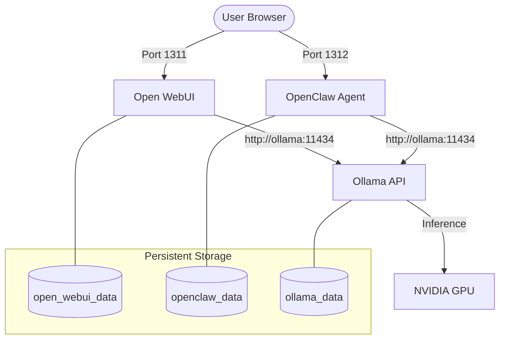

# System Architecture - AI Chat Docker

This document describes the high-level architecture of the local AI chatbot system based on the `docker-compose.yml` configuration.

## System Overview

The system is a containerized stack that provides individual web-based interfaces for chat and autonomous agents.

### Components

1. **Open WebUI (Frontend/Interface)**:
   - **Access**: Host port `1311`.
   - **Role**: Primary chat interface for human interaction.

2. **OpenClaw (Autonomous Agent)**:
   - **Access**: Host port `1312`.
   - **Role**: Autonomous AI agent that can perform tasks, manage files, and execute shell commands.
   - **Gateway**: Web-based interface.

3. **Ollama (AI Engine/Backend)**:
   - **Access**: Internal port `11434`.
   - **Role**: Serves LLMs (e.g., `qwen-coder`) and handles inference requests.
   - **Hardware Acceleration**: GPU enabled.

## Data Flow & Connectivity

## Configuration Details

- **Internal Hostname**: Both Open WebUI and OpenClaw connect to Ollama using the hostname `ollama`.
- **Dependencies**: Frontend services depend on the `ollama` container.
- **Rules**: AI assistant provides configuration only; execution and debugging are handled by the user.

---
*Updated on: 2026-03-22*
