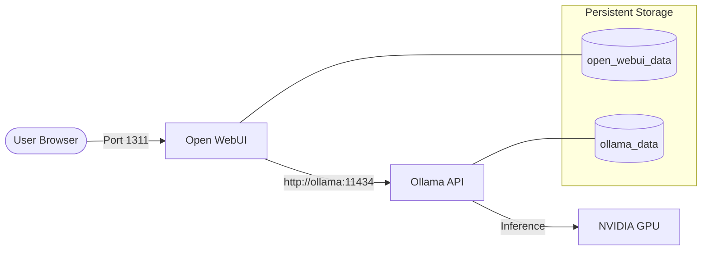

# System Architecture - AI Chat Docker

This document describes the high-level architecture of the local AI chatbot system based on the `docker-compose.yml` configuration.

## System Overview

The system is a containerized stack that provides a web-based UI for interacting with large language models (LLMs) served locally.

### Components

1. **Open WebUI (Frontend/Interface)**:
   - **Image**: `ghcr.io/open-webui/open-webui:main`
   - **Access**: Accessible on host port `1311` (internal port `8080`).
   - **Role**: Provides the chat interface, user management, and API gateway to the AI engine.
   - **Storage**: Uses `open_webui_data` volume for configuration and chat history.

2. **Ollama (AI Engine/Backend)**:
   - **Image**: `ollama/ollama:latest`
   - **Access**: Internal port `11434`.
   - **Role**: Serves LLMs and handles inference requests.
   - **Hardware Acceleration**: Configured to use NVIDIA GPUs for better performance.
   - **Storage**: Uses `ollama_data` volume for storing downloaded models.

## Data Flow & Connectivity

## Configuration Details

- **Internal Hostname**: Open WebUI connects to Ollama using the hostname `ollama`, which is resolved automatically by the Docker internal network.
- **Dependencies**: Open WebUI depends on Ollama to be started first.
- **GPU Driver**: The system requires the NVIDIA Container Toolkit to be installed on the host to enable GPU acceleration for Ollama.

---
*Generated by AI Assistant on: 2026-03-22*
